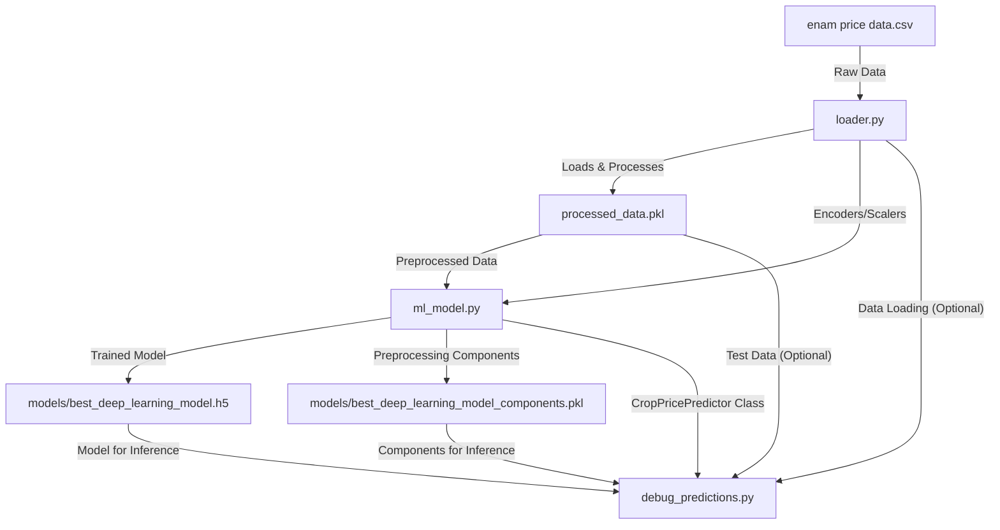

# Crop Price Predictor

[](https://github.com/harsha4261/crop-price-predictor/blob/main/LICENSE)
[](https://github.com/harsha4261/crop-price-predictor/commits/main)
[](https://github.com/harsha4261/crop-price-predictor)

## Description

This project implements a Crop Price Predictor using deep learning techniques. It is designed to forecast crop prices based on historical market data, leveraging a structured pipeline for data processing, model training, and prediction. The system handles data loading, cleaning (missing value imputation), feature engineering (extracting date components), categorical encoding, numerical scaling, and trains a Keras deep learning model for robust price prediction. The trained model and its associated preprocessing components are persisted for efficient inference.

## Directory Structure

```
.
├── debug_predictions.py
├── enam price data.csv
├── loader.py
├── ml_model.py
├── models/
│   ├── best_deep_learning_model.h5
│   └── best_deep_learning_model_components.pkl
└── processed_data.pkl
```

## Dependency Graph

The following diagram illustrates the dependencies between the main components of the `crop-price-predictor` project:



## Features

*   **Automated Data Preprocessing**: Handles missing values, extracts time-based features (Year, Month, Day) from date fields, applies Label Encoding for categorical features, and Standard Scaling for numerical features.
*   **Deep Learning Model**: Utilizes a Sequential Keras model with Dense layers and ReLU activation for robust price prediction.
*   **Model Training and Persistence**: Includes functionality to train the deep learning model, save the best-performing model (`.h5`), and persist all necessary preprocessing transformers (LabelEncoders, StandardScalers, MinMaxScaler) using `pickle` for consistent inference.
*   **Performance Evaluation**: Evaluates the model's performance using metrics such as R2 score and Mean Absolute Percentage Error (MAPE).
*   **Predictive Inference**: Provides a clear workflow for loading the trained model and its components to make accurate predictions on new, unseen data.
*   **Modular Design**: Separates concerns into `loader.py` (data handling), `ml_model.py` (model training and prediction logic), and `debug_predictions.py` (inference and debugging).

## Installation

This project is built using Python and relies on several popular machine learning and data science libraries. To set up the environment, follow these steps:

1.  **Clone the Repository**:
    ```bash
    git clone https://github.com/harsha4261/crop-price-predictor.git
    cd crop-price-predictor
    ```

2.  **Create a Virtual Environment (Recommended)**:
    ```bash
    python -m venv venv
    # On Windows
    .\venv\Scripts\activate
    # On macOS/Linux
    source venv/bin/activate
    ```

3.  **Install Dependencies**:
    The project relies on libraries such as `tensorflow`, `scikit-learn`, `pandas`, and `numpy`. You can install them using `pip`:
    ```bash
    pip install tensorflow scikit-learn pandas numpy
    ```
    *(Note: A `requirements.txt` file would be ideal here. If one existed, you would use `pip install -r requirements.txt`)*

## Usage

The project provides scripts for training the model and for debugging/making predictions.

### 1. Prepare Data

Place your raw crop price data in a CSV file named `enam price data.csv` in the root directory of the project. This file should contain relevant columns such as 'State', 'District', 'Market', 'Commodity', 'Year', 'Month', 'Day', and a target price column (e.g., 'Modal Price').

### 2. Train the Model

To train the deep learning model, run the `ml_model.py` script. This script will load and preprocess the data, train the model, and save the best model weights (`.h5`) and preprocessing components (`.pkl`) into the `models/` directory.

```bash
python ml_model.py
```

This script will:
*   Load `enam price data.csv`.
*   Perform all necessary data preprocessing.
*   Train the deep learning model.
*   Save `models/best_deep_learning_model.h5` and `models/best_deep_learning_model_components.pkl`.
*   Print training progress and final evaluation metrics.

### 3. Make Predictions and Debug

The `debug_predictions.py` script demonstrates how to load the trained model and its components to make predictions on test data and evaluate the model's performance.

```bash
python debug_predictions.py
```

This script will:
*   Load the saved model and components.
*   Load the preprocessed data (or process raw data if `processed_data.pkl` is not present).
*   Make predictions on a subset of the data.
*   Print actual vs. predicted values, along with R2 score and MAPE for debugging and evaluation.

## License

This project is licensed under the MIT License.

```
MIT License

Copyright (c) 2023 harsha4261

Permission is hereby granted, free of charge, to any person obtaining a copy
of this software and associated documentation files (the "Software"), to deal
in the Software without restriction, including without limitation the rights
to use, copy, modify, merge, publish, distribute, sublicense, and/or sell
copies of the Software, and to permit persons to whom the Software is
furnished to do so, subject to the following conditions:

The above copyright notice and this permission notice shall be included in all
copies or substantial portions of the Software.

THE SOFTWARE IS PROVIDED "AS IS", WITHOUT WARRANTY OF ANY KIND, EXPRESS OR
IMPLIED, INCLUDING BUT NOT LIMITED TO THE WARRANTIES OF MERCHANTABILITY,
FITNESS FOR A PARTICULAR PURPOSE AND NONINFRINGEMENT. IN NO EVENT SHALL THE
AUTHORS OR COPYRIGHT HOLDERS BE LIABLE FOR ANY CLAIM, DAMAGES OR OTHER
LIABILITY, WHETHER IN AN ACTION OF CONTRACT, TORT OR OTHERWISE, ARISING FROM,
OUT OF OR IN CONNECTION WITH THE SOFTWARE OR THE USE OR OTHER DEALINGS IN THE
SOFTWARE.
```
*(Note: A `LICENSE` file was not present in the repository, so a standard MIT License has been included as a placeholder. It is recommended to create a `LICENSE` file in the root of the repository.)*

## Contribution Guidelines

We welcome contributions to the Crop Price Predictor project! If you have suggestions for improvements, new features, or bug fixes, please follow these guidelines:

1.  **Fork the repository**: Start by forking the `crop-price-predictor` repository to your GitHub account.
2.  **Create a new branch**: For each new feature or bug fix, create a dedicated branch.
    ```bash
    git checkout -b feature/your-feature-name
    # or
    git checkout -b bugfix/issue-description
    ```
3.  **Make your changes**: Implement your changes, ensuring code quality, proper commenting, and adherence to existing coding styles.
4.  **Test your changes**: If applicable, add or update tests to cover your modifications.
5.  **Commit your changes**: Write clear and concise commit messages.
    ```bash
    git commit -m "feat: Add new feature for X"
    # or
    git commit -m "fix: Resolve bug where Y happened"
    ```
6.  **Push to your fork**: Push your changes to your forked repository.
    ```bash
    git push origin feature/your-feature-name
    ```
7.  **Open a Pull Request**: Go to the original `crop-price-predictor` repository and open a new Pull Request from your branch. Provide a detailed description of your changes.
